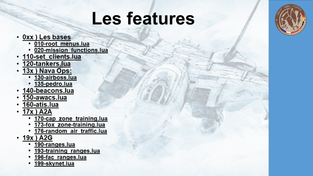
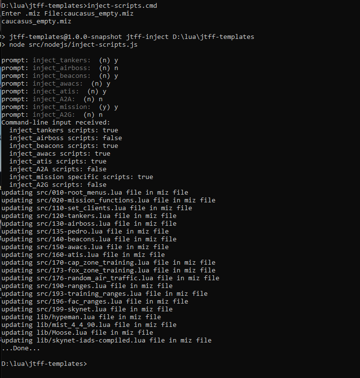

# JTFF mission templates script utilities

This set of scripts help handle the JTFF mission templates
It provides functional scripts to handle all kind of support in your missions like

* Airboss
* AWACS
* Airborne Tankers
* Ground practice ranges
* Air to air practice ranges
* etc...

All aspects of mission that it can handle is described in the powerpoint document here :
https://github.com/JTFF-mission-scripts/jtff-templates/blob/develop/docs/jtff-templates-manual.pdf

It's still a highly WIP but it may help you get onboard with mission scripting JTFF-style...


# Installation instruction

## prerequisites

you must have installed on your computer :
* DCSWorld with a version >= 2.7 : https://www.digitalcombatsimulator.com/upload/iblock/d4f/DCS_World_OpenBeta_web.exe
* Git for windows version >=2.0 : https://github.com/git-for-windows/git/releases/download/v2.35.1.windows.2/Git-2.35.1.2-64-bit.exe
* NodeJs version >=16.0: https://nodejs.org/dist/v16.14.0/node-v16.14.0-x64.msi
* A code editor like :
  * Notepad++: https://notepad-plus-plus.org/downloads/v8.3.1/
  * or SublimeText: https://download.sublimetext.com/Sublime%20Text%20Build%203211%20x64%20Setup.exe
  * or Eclipse: http://eclipse.org/downloads/download.php?file=/ldt/products/stable/1.4.2/org.eclipse.ldt.product-win32.win32.x86_64.zip

## Features provided



## installation
clone this repo at :
https://github.com/JTFF-mission-scripts/jtff-templates.git

`git clone https://github.com/JTFF-mission-scripts/jtff-templates.git`

and you're good to go

All the mission you will generate will be delivered in the **./build** folder

# Scripts provided

## cleanup
You can cleanup all the build folder to get back on your feet if you get lost.

```
npm run clean
```

## build template missions
To generate template missions for JTFF based on the scripts provided in this repo you can run :
```
npm run build
```
It will provide in the **./build** folder all the JTFF-templates for all the theatres described in the **./config.json file**.

You can of course edit this config.json file to modify the theatres you want to generate a template mission.

## inject JTFF scripts in a new mission
You can also use the JTFF-scripts in your own missions. If you want to inject some scripts in the mission you juste created, you can run the script **inject-scripts.cmd**

It will prompt you for the miz file you want to inject the JTFF scripts into and also ask you which scripts you want to inject :




## inject additional JTFF-scripts in an already JTFF-scripted mission

WIP...
